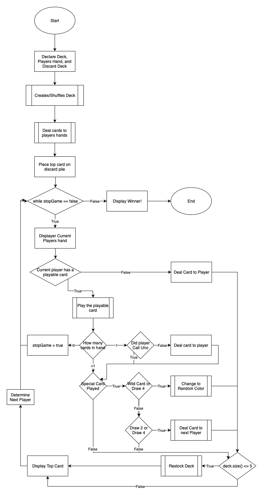
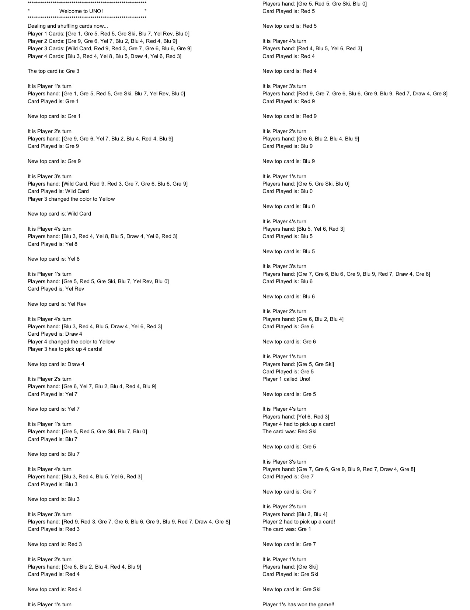

# UNOGame

For recreating the card game of UNO I used the java programming language and Eclipse as an IDE. The project was to create an automated game of UNO using the four pillars of Object Oriented Programming: inheritance, encapsulation, abstraction, and polymorphism. This program ran through a game of UNO with four players all starting with 7 cards. Each move done by the players were printed out the console to see all the moves made until one player runs out of cards winning the game. 

Below is a project overview containing all the step that came together in order to complete the program. In total there were 5 milestones that were achieved before the game officially met all requirements of the game. This document goes over each one when the project was completed looking back at each step:

	

<h2>Design</h2>

<h3>UML Diagram</h3>

	

<h3>Flow Chart</h3>

	

<h3>Final Product</h3>

Our objective of this project was to be able to render a full game of UNO and print all the action taken from each player until a player had won the game. Below is the output to the user:

	

